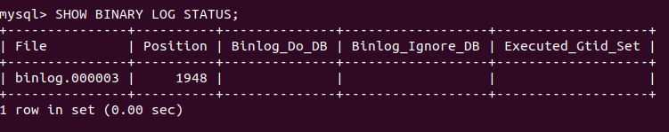
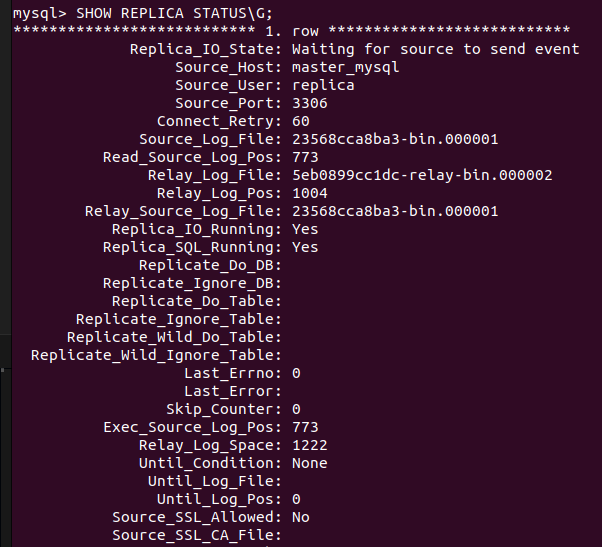
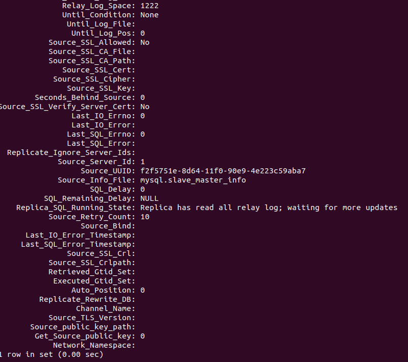

# Домашнее задание к занятию "`Репликация и масштабирование. Часть 1`" - `Егоян Андрей Владимирович`

### Задание 1

Режим Master-Slave:

Master сервер — главный, в него идут CRUD запросы. Slave сервер — ведомый, только читает данные, копируя изменения с мастера.

Режим Master-Master:

Есть два главных сервера. В оба можно писать данные. Они синхронно обмениваются изменениями.

### Задание 2

Выполните конфигурацию master-slave репликации, примером можно пользоваться из лекции.

По примеру из лекции создал 2 контейнера и через команду docker ps посмотрел контейнеры:

IMAGE COMMAND STATUS PORTS NAMES

mysql:8.4 "docker-entrypoint.s…" 3306/tcp, 33060/tcp replica_mysql

mysql:8.4 "docker-entrypoint.s…" 3306/tcp, 33060/tcp master_mysql

На скриншота видно настройки для схема репликации master-slave. На мастере с помощью соответствующей команды мастер-сервера смотрим статус, и аналогично для slave-сервер с другой командой. Обращаю внимание на "Source_Host", *IO* и *SQL* *running: Yes. "Replica_SQL_Running_State" соответствует рабочему состоянию репликации.

Прикладываю скриншоты:

